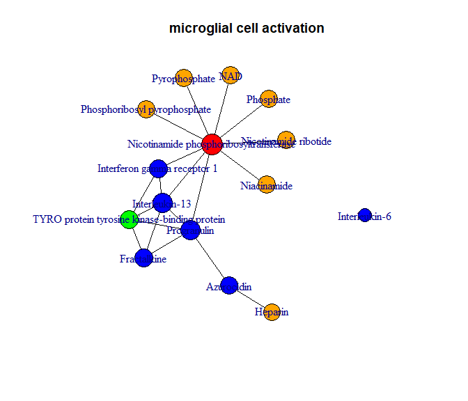

The Immunometabolic Atlas
================

## Introduction

This R package is part of our publication called “The Immunometabolic Atlas”. 
It is able to construct immune system-related protein-metabolite
interaction networks. The package features an RShiny application, but
also a set of tools for constructing graphs and identifying important
biological processes.

## Installation

Use the `devtools` package to install our package and dependencies.

``` r
install.packages("devtools")
devtools::install_github("vanhasseltlab/IMatlas")
```

## Getting Started

### Setting up the configuration file

To link the Python and R scripts, a configuration file is used, called
`config.yaml`. This file needs to contain the following fields:

-   folder: Path where data files are going to be stored
-   relative\_path: True/False. Is the folder given relative to the
    working directory?
-   GO\_ID: Gene Ontology identifier of which all offspring terms are
    used as a filter

By default, the following settings are used.

    folder: Data
    relative_path: True
    GO_ID: GO:0002376

### Preprocessing data

Before using this package, you will need to obtain data using our Python
scripts. These are located in the Python folder and only have to be
executed once. The scripts will download and extract all data to the
given folder in the configuration file. Preprocessing is done by running
the following code:

``` r
library(IMatlas)
run_preprocessing("path/to/config.yaml")
```

### Start the RShiny app

``` r
library(IMatlas)
load_data(config = "path/to/config.yaml")
run_shiny()
```

### Non-Shiny usages

Example, static graph

``` r
library(IMatlas)
load_data(config = "path/to/config.yaml")
graph <- example_graph()
plot(graph)
```

    ## Search filter: microglial cell activation

    ## Found 104 nodes & 394 edges



To get a similar interactive graph as in the Shiny app, you can convert
the graph to a Plotly object.

``` r
to_plotly(graph)
```

<!-- -->

### Advanced usages

To function `get_graph()` is the main function for obtaining a
graph-structure representing your search. It takes the following
parameters, see the documentation for additional descriptions and
examples.

<div class="kable-table">

| Argument        | Default       | Description                                                                                                                                                                                                                                                                                                     |
|:----------------|:--------------|:----------------------------------------------------------------------------------------------------------------------------------------------------------------------------------------------------------------------------------------------------------------------------------------------------------------|
| filter          | NA            | The search term for building the graph. Cannot be empty.                                                                                                                                                                                                                                                        |
| neighbours      | 0             | Integer value representing the number of neighbours (steps) to be found.                                                                                                                                                                                                                                        |
| max\_neighbours | Inf           | Maximum number of edges a node allowed. Can be used to remove super hubs e.g. Water or ATP.                                                                                                                                                                                                                     |
| simple          | FALSE         | Returns a barebone igraph object with only identifiers and names. Useful when only the graph structure is needed.                                                                                                                                                                                               |
| omit\_lipids    | FALSE         | Removes any metabolite with the superclass ‘Lipids and lipid-like molecules’.                                                                                                                                                                                                                                   |
| type            | Gene Ontology | Type of the search filter. Can be one of the following: `Gene Ontology`, `Metabolite/Proteins`, `Pathways`, `GO Simple`, `Superclasses`, `Classes`.                                                                                                                                                             |
| search\_mode    | Interacts     | Determines how interactions are found. `Interacts` (default) will find all possible interactions, while `Between` will only find interactions between the given metabolites / proteins. `Shortest Path` will find the shortest route between the metabolites / proteins given, including indirect interactions. |
| verbose         | TRUE          | If `TRUE` prints a small summary of the graph including the number of metabolites / proteins and interactions.                                                                                                                                                                                                  |

</div>

If the argument `simple = FALSE` (default), metadata is included in the
returned igraph object. This includes the following:

<div class="kable-table">

| Name       | Description                                                                                                                                                        |
|:-----------|:-------------------------------------------------------------------------------------------------------------------------------------------------------------------|
| id         | Identifier of the protein or metabolite.                                                                                                                           |
| name       | Full name of the protein or metabolite.                                                                                                                            |
| closeness  | Harmonic closeness score of the node. Indicates its importance in the graph.                                                                                       |
| go         | Gene Ontologies associated to the node.                                                                                                                            |
| type       | Type of the node, can be either `Metabolite`, `Protein`, `Enzyme` or `Transporter`.                                                                                |
| color      | Color of the node                                                                                                                                                  |
| enzyme     | Enzyme code if the node is an enzyme.                                                                                                                              |
| cofactor   | Metabolite ID that functions as a cofactor to the protein.                                                                                                         |
| confidence | Confidence (0-1000) of the interaction. Only for protein-protein interactions this number is representive. All other interactions have a confidence score of 1000. |

</div>

However, when `simple = TRUE`, only the `id`, `name`, and `confidence`
are stored. Several helpers functions exist that can be chained to
obtain metadata. These have support for the `dplyr` pipe notation. A
complete example that mimics the `example_graph()` function is showed
below. However, optional helper functions exist, as mentioned in the
table below the example.

``` r
graph <- get_graph("microglial cell activation", simple = TRUE) %>%
  add_closeness() %>%
  add_gos() %>%
  add_metadata() %>%
  add_node_types() %>%
  add_vertice_colors() %>%
  add_layout()
```

| Name                  | Description                                                                                                      |
|:----------------------|:-----------------------------------------------------------------------------------------------------------------|
| `add_closeness`       | Calculates the Harmonic Closeness per node to determine it’s importance in the graph                             |
| `add_gos`             | Calculates p-values for each Gene Ontology present in the current graph                                          |
| `add_metadata`        | Adds vertice metadata about enzymes, pathways, and (super)classes                                                |
| `add_node_types`      | Adds types about each node                                                                                       |
| `add_vertice_colors`  | Adds colors to each type of node and edge.                                                                       |
| `add_layout`          | Calculates a Fruchterman-Reingold layout so each node is placed visually pleasing.                               |
| `add_communities`     | Uses the Leiden algorithm to identify communities within the current graph.                                      |
| `remove_unconnected`  | Removes any node that has no interaction with other nodes.                                                       |
| `metabolite_go_graph` | Convert the graph to a graph where Gene Ontologies are represented by nodes. Requires `add_gos` to be run first. |

Helper functions for chaining calculations and (meta)data

### Summarize results

Display an overview of biological processes and importances per
metabolite. Sorts by p-value (ascending) and closeness (descending). A
threshold for both the p-value and closeness can be given.

``` r
example_graph() %>%
  metabolic_process_summary(pvalue = 0.05, closeness = 0.5) %>%
  head(10)
```

<div class="kable-table">

|      | Metabolite                   | Closeness | GO                         | pvalue |
|:-----|:-----------------------------|----------:|:---------------------------|-------:|
| 676  | Cer(d18:1/23:0)              |     0.661 | microglial cell activation |      0 |
| 997  | Cer(d18:1/12:0)              |     0.590 | microglial cell activation |      0 |
| 682  | FAD                          |     0.562 | microglial cell activation |      0 |
| 321  | Calcium                      |     0.557 | microglial cell activation |      0 |
| 1024 | Cer(d18:1/18:0)              |     0.557 | microglial cell activation |      0 |
| 600  | Sphingosine 1-phosphate      |     0.552 | microglial cell activation |      0 |
| 1042 | Cer(d18:1/22:0)              |     0.552 | microglial cell activation |      0 |
| 1006 | Cer(d18:1/18:1(9Z))          |     0.549 | microglial cell activation |      0 |
| 312  | Manganese                    |     0.545 | microglial cell activation |      0 |
| 606  | Phosphoribosyl pyrophosphate |     0.544 | microglial cell activation |      0 |

</div>
