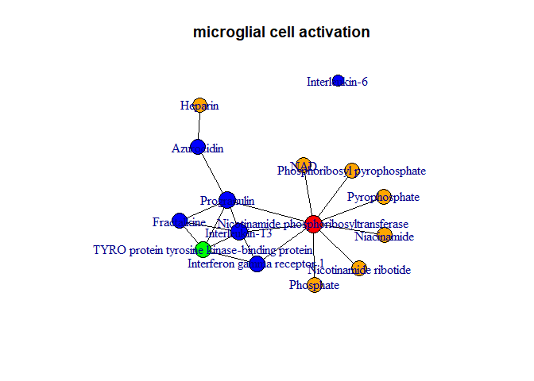

Immuno Metabolome Atlas
================

# Introduction

This package is part of our publication called “Immuno metabolome
atlas”.

# Installation

## Python

Dependencies needed:

-   Pandas
-   Numpy

The script will attempt to install these if they cannot be imported.

## R

Use the `devtools` to install our package and dependencies.

    install.packages("devtools")
    devtools::install_github("vanhasseltlab/ImmuneMetAtlas")

# Getting Started

## Setting up the configuration file

To link the Python and R scripts, a YAML (Yet Another Markdown Language)
configuration file is used, called `config.yaml`. This file needs to
contain at least the follwing fields:

-   folder: Path where data files are going to be stored
-   shiny\_folder: Path to where the shiny app folder is located (may be
    discarded in the future)
-   GO\_ID: Gene Ontology identifier of which all offspring terms are
    used as a filter

## Preprocessing data

Before using this package, you will need to obtain data using our Python
scripts. These are located in the ‘Preprocessing’ folder and only has be
executed once. Preprocessing is done by running `Preprocessing.py`,
which can be done by either of the following options:

-   Retain the files in the current folder structure and run the script
    (default)
-   Change the variable `config_path` in `Preprocessing.py` to its
    actual location
-   Run the script in a terminal with the first argument being the path
    to `config.yaml`

The scripts will download and extract all data to the given folder in
the configuration file.

## Start the RShiny app

    library("ImmuneMetAtlas")
    load_data(config = "config.yaml")
    run_shiny()

## Non-Shiny usages

Example, static graph

    library("ImmuneMetAtlas")
    load_data(config = "config.yaml")
    graph <- example_graph()
    plot(graph)

*Example of a Gene Ontology graph*

Interactive plotly graph in browser

    to_plotly(graph)

Basically `get_graph()` is the main function for obtaining a
graph-structure representing your search. It takes the parameters
`filter`, `type`, `search_mode`, `neighbours`, `max_neighbours` and
`simple`. See the documentation within the R package for full
explanation and examples of these parameters.

    graph <- get_graph(filter = "microglial cell activation", type = "Gene Ontology")
    plot(graph)

Obtain p-values of metabolite - GO associations in a long dataframe
format:

    head(get_metabolite_go_pvalues(graph))

When you only need the graph structure, use `simple = TRUE`. This is
especially handy when constructing a lot of graphs. Note that only the
bare minimum data is stored.

    get_graph(filter = "microglial cell activation", type = "Gene Ontology", simple = TRUE)

    ## IGRAPH 2be2c92 UN-- 15 19 -- 
    ## + attr: main (g/c), name (v/c)
    ## + edges from 2be2c92 (vertex names):
    ##  [1] P15260--P35225      P15260--O43914      P15260--P43490     
    ##  [4] P28799--P20160      P28799--P35225      P28799--P78423     
    ##  [7] P28799--O43914      P28799--P43490      P20160--HMDB0001394
    ## [10] P35225--P78423      P35225--O43914      P35225--P43490     
    ## [13] P78423--O43914      P43490--HMDB0000229 P43490--HMDB0000250
    ## [16] P43490--HMDB0000280 P43490--HMDB0000902 P43490--HMDB0001406
    ## [19] P43490--HMDB0001429
